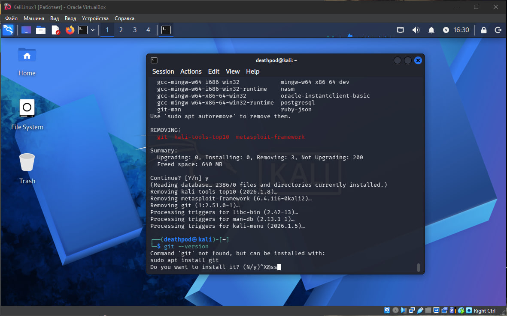
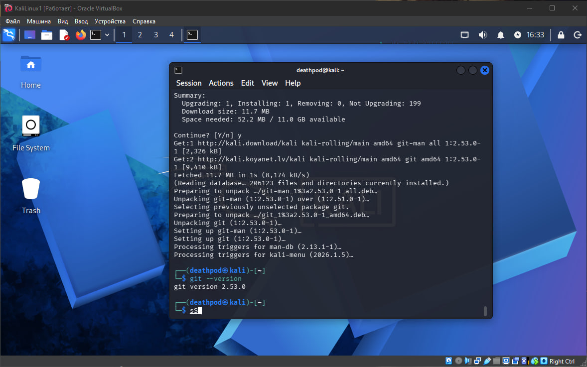
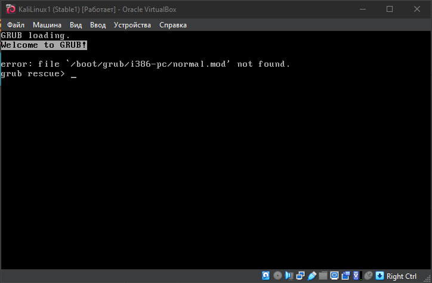
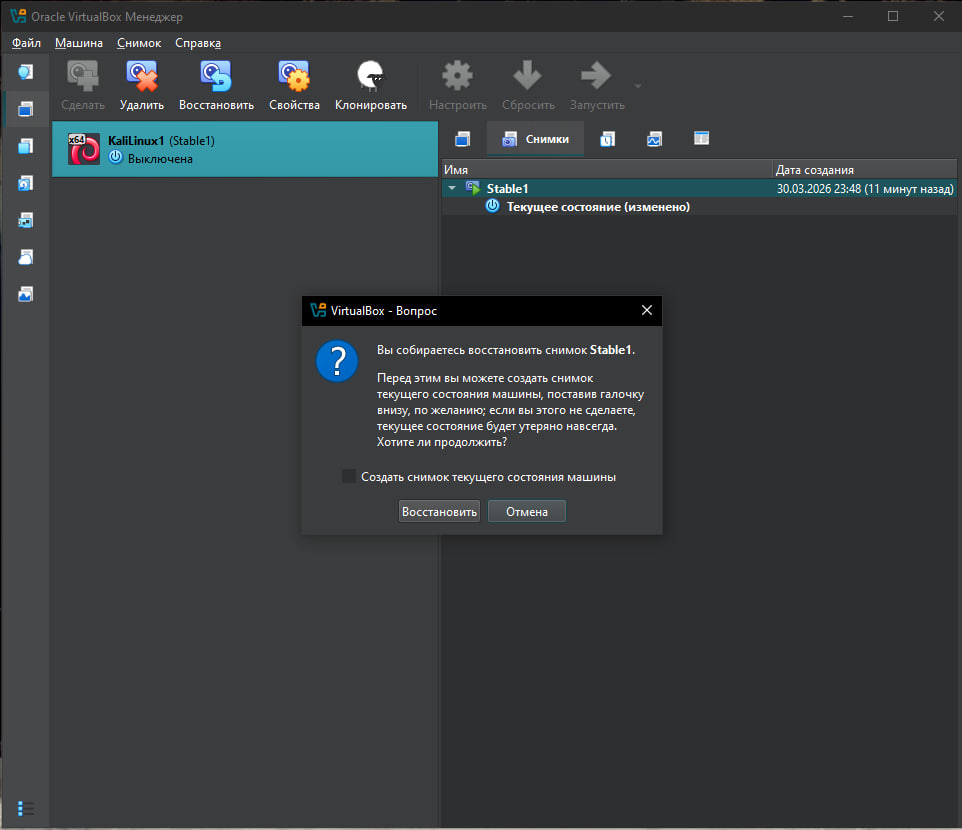
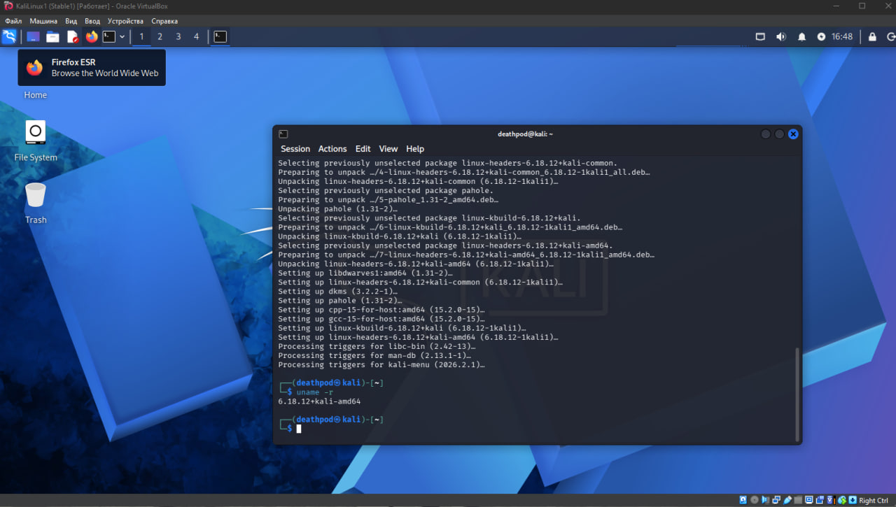

### Скрины

### Листинг команд

## touch

┌──(deathpod㉿kali)-[~] 
└─$ touch one.txt

┌──(deathpod㉿kali)-[~] 
└─$ ls -lah one.txt 
-rw-rw-r-- 1 deathpod deathpod 0 Mar 31 08:07 one.txt

-----

┌──(deathpod㉿kali)-[~] 
└─$ touch one.txt two.txt

┌──(deathpod㉿kali)-[~] 
└─$ ls -lah one.txt two.txt 
-rw-rw-r-- 1 deathpod deathpod 0 Mar 31 08:09 one.txt 
-rw-rw-r-- 1 deathpod deathpod 0 Mar 31 08:09 two.txt 

-----

┌──(deathpod㉿kali)-[~] 
└─$ touch -c one.txt

┌──(deathpod㉿kali)-[~] 
└─$ ls -lah one.txt 
-rw-rw-r-- 1 deathpod deathpod 0 Mar 31 08:10 one.txt

-----

┌──(deathpod㉿kali)-[~] 
└─$ touch -a one.txt

┌──(deathpod㉿kali)-[~] 
└─$ ls -lah one.txt 
-rw-rw-r-- 1 deathpod deathpod 0 Mar 31 08:10 one.txt (изменение времени последнего доступа)

-----

┌──(deathpod㉿kali)-[~] 
└─$ touch -m one.txt

┌──(deathpod㉿kali)-[~] 
└─$ ls -lah one.txt 
-rw-rw-r-- 1 deathpod deathpod 0 Mar 31 08:14 one.txt (изменение времени последнего изменения файла)

-----

┌──(deathpod㉿kali)-[~] 
└─$ touch -t 202602261250 one.txt

┌──(deathpod㉿kali)-[~] 
└─$ ls -lah one.txt 
-rw-rw-r-- 1 deathpod deathpod 0 Feb 26 12:50 one.txt (установка конкретного времени)

-----

┌──(deathpod㉿kali)-[~] 
└─$ touch -r two.txt one.txt

┌──(deathpod㉿kali)-[~] 
└─$ ls -lah one.txt 
-rw-rw-r-- 1 deathpod deathpod 0 Mar 31 08:09 one.txt

## cat

┌──(deathpod㉿kali)-[~] 
└─$ cat one.txt 
one

-----

┌──(deathpod㉿kali)-[~] 
└─$ cat one.txt two.txt  
one 
two 

-----

┌──(deathpod㉿kali)-[~] 
└─$ cat > three.txt 
three 

^C

-----

┌──(deathpod㉿kali)-[~] 
└─$ cat three.txt 
three

-----

┌──(deathpod㉿kali)-[~] 
└─$ cat one.txt two.txt > four.txt

┌──(deathpod㉿kali)-[~] 
└─$ cat four.txt 
one 
two

-----

┌──(deathpod㉿kali)-[~] 
└─$ cat three.txt >> four.txt

┌──(deathpod㉿kali)-[~] 
└─$ cat four.txt 
one 
two 
three

-----

┌──(deathpod㉿kali)-[~] 
└─$ cat -n four.txt 
     1  one 
     2  two 
     3  three 
     4

-----

┌──(deathpod㉿kali)-[~] 
└─$ cat -b four.txt 
     1  one 
     2  two 
     3  three

-----

┌──(deathpod㉿kali)-[~] 
└─$ cat -s four.txt 
one 
two 
three

-----

┌──(deathpod㉿kali)-[~] 
└─$ cat -E four.txt 
one$ 
two$ 
three$ 
$

-----

┌──(deathpod㉿kali)-[~] 
└─$ cat -T four.txt 
one 
two 
three 

## nano

┌──(deathpod㉿kali)-[~] 
└─$ nano four.txt

-----

┌──(deathpod㉿kali)-[~] 
└─$ sudo nano four.txt 
[sudo] password for deathpod:

-----

┌──(deathpod㉿kali)-[~] 
└─$ nano +2 four.txt (открыть на определенной строке)

-----

┌──(deathpod㉿kali)-[~] 
└─$ nano -l four.txt (открыть с нумерацией строк)

-----

┌──(deathpod㉿kali)-[~] 
└─$ nano -m four.txt (открыть с поддержкой мыши)

## pwd

┌──(deathpod㉿kali)-[~] 
└─$ pwd 
/home/deathpod

-----

┌──(deathpod㉿kali)-[~] 
└─$ pwd -L 
/home/deathpod (логический)

-----

┌──(deathpod㉿kali)-[~] 
└─$ pwd -P 
/home/deathpod (физический)

## ls

┌──(deathpod㉿kali)-[~] 
└─$ ls 
deathpod  Documents  four.txt  log1   nohup.out  paused.conf  ping.log  Templates  two.txt 
Desktop   Downloads  log       Music  one.txt    Pictures     Public    three.txt  Videos

-----

┌──(deathpod㉿kali)-[~] 
└─$ ls -l 
total 112 
-rw-rw-r-- 1 deathpod deathpod  7904 Mar 31 08:46 deathpod 
drwxr-xr-x 2 deathpod deathpod  4096 Mar 28 16:43 Desktop 
drwxr-xr-x 2 deathpod deathpod  4096 Mar 28 16:43 Documents 
drwxr-xr-x 2 deathpod deathpod  4096 Mar 28 16:43 Downloads 
-rw-rw-r-- 1 deathpod deathpod    15 Mar 31 08:32 four.txt 
-rw-rw-r-- 1 deathpod deathpod 13585 Mar 31 08:46 log 
-rw-rw-r-- 1 deathpod deathpod   115 Mar 30 14:30 log1 
drwxr-xr-x 2 deathpod deathpod  4096 Mar 28 16:43 Music 
-rw------- 1 deathpod deathpod 18427 Mar 30 14:01 nohup.out 
-rw-rw-r-- 1 deathpod deathpod     4 Mar 31 08:25 one.txt 
-rw-r--r-- 1 root     root       229 Mar 30 18:40 paused.conf 
drwxr-xr-x 2 deathpod deathpod  4096 Mar 28 16:43 Pictures 
-rw-rw-r-- 1 deathpod deathpod 11849 Mar 30 14:01 ping.log 
drwxr-xr-x 2 deathpod deathpod  4096 Mar 28 16:43 Public 
drwxr-xr-x 2 deathpod deathpod  4096 Mar 28 16:43 Templates 
-rw-rw-r-- 1 deathpod deathpod     7 Mar 31 08:28 three.txt 
-rw-rw-r-- 1 deathpod deathpod     4 Mar 31 08:27 two.txt 
drwxr-xr-x 2 deathpod deathpod  4096 Mar 28 16:43 Videos

-----

┌──(deathpod㉿kali)-[~] 
└─$ ls -a 
.                 .java                      two.txt 
..                .local                     .vboxclient-clipboard-tty7-control.pid 
.bash_logout      log                        .vboxclient-clipboard-tty7-service.pid 
.bashrc           log1                       .vboxclient-draganddrop-tty7-control.pid 
.bashrc.original  Music                      .vboxclient-draganddrop-tty7-service.pid 
.cache            nohup.out                  .vboxclient-hostversion-tty7-control.pid 
.config           one.txt                    .vboxclient-seamless-tty7-control.pid 
deathpod          paused.conf                .vboxclient-seamless-tty7-service.pid 
Desktop           Pictures                   .vboxclient-vmsvga-session-tty7-control.pid 
.dmrc             ping.log                   .vboxclient-vmsvga-session-tty7-service.pid 
Documents         .profile                   Videos 
Downloads         Public                     .Xauthority 
.face             .selected_editor           .xsession-errors 
.face.icon        .ssh                       .xsession-errors.old 
four.txt          .sudo_as_admin_successful  .zprofile 
.gnupg            Templates                  .zsh_history 
.ICEauthority     three.txt                  .zshrc

-----

┌──(deathpod㉿kali)-[~] 
└─$ ls -la 
total 260 
drwx------ 16 deathpod deathpod  4096 Mar 31 08:42 . 
drwxr-xr-x  3 root     root      4096 Mar 28 16:38 .. 
-rw-r--r--  1 deathpod deathpod   220 Mar 28 16:38 .bash_logout 
-rw-r--r--  1 deathpod deathpod  5578 Mar 28 16:38 .bashrc 
-rw-r--r--  1 deathpod deathpod  3526 Mar 28 16:38 .bashrc.original 
drwxrwxr-x  8 deathpod deathpod  4096 Mar 30 18:17 .cache 
drwxr-xr-x 16 deathpod deathpod  4096 Mar 30 13:50 .config 
-rw-rw-r--  1 deathpod deathpod  7936 Mar 31 08:47 deathpod 
drwxr-xr-x  2 deathpod deathpod  4096 Mar 28 16:43 Desktop 
-rw-r--r--  1 deathpod deathpod    35 Mar 28 16:43 .dmrc 
drwxr-xr-x  2 deathpod deathpod  4096 Mar 28 16:43 Documents 
drwxr-xr-x  2 deathpod deathpod  4096 Mar 28 16:43 Downloads 
-rw-r--r--  1 deathpod deathpod 11759 Mar 28 16:38 .face 
lrwxrwxrwx  1 deathpod deathpod     5 Mar 28 16:38 .face.icon -> .face 
-rw-rw-r--  1 deathpod deathpod    15 Mar 31 08:32 four.txt 
drwx------  3 deathpod deathpod  4096 Mar 28 16:43 .gnupg 
-rw-------  1 deathpod deathpod     0 Mar 28 16:43 .ICEauthority 
drwxr-xr-x  3 deathpod deathpod  4096 Mar 28 16:38 .java 
drwxr-xr-x  5 deathpod deathpod  4096 Mar 28 16:43 .local 
-rw-rw-r--  1 deathpod deathpod 13640 Mar 31 08:47 log 
-rw-rw-r--  1 deathpod deathpod   115 Mar 30 14:30 log1 
drwxr-xr-x  2 deathpod deathpod  4096 Mar 28 16:43 Music 
-rw-------  1 deathpod deathpod 18427 Mar 30 14:01 nohup.out 
-rw-rw-r--  1 deathpod deathpod     4 Mar 31 08:25 one.txt 
-rw-r--r--  1 root     root       229 Mar 30 18:40 paused.conf 
drwxr-xr-x  2 deathpod deathpod  4096 Mar 28 16:43 Pictures 
-rw-rw-r--  1 deathpod deathpod 11849 Mar 30 14:01 ping.log 
-rw-r--r--  1 deathpod deathpod   807 Mar 28 16:38 .profile 
drwxr-xr-x  2 deathpod deathpod  4096 Mar 28 16:43 Public 
-rw-rw-r--  1 deathpod deathpod    66 Mar 30 14:10 .selected_editor 
drwx------  3 deathpod deathpod  4096 Mar 28 16:43 .ssh 
-rw-r--r--  1 deathpod deathpod     0 Mar 30 13:46 .sudo_as_admin_successful 
drwxr-xr-x  2 deathpod deathpod  4096 Mar 28 16:43 Templates 
-rw-rw-r--  1 deathpod deathpod     7 Mar 31 08:28 three.txt 
-rw-rw-r--  1 deathpod deathpod     4 Mar 31 08:27 two.txt 
-rw-r-----  1 deathpod deathpod     5 Mar 31 07:29 .vboxclient-clipboard-tty7-control.pid 
-rw-r-----  1 deathpod deathpod     5 Mar 31 07:29 .vboxclient-clipboard-tty7-service.pid 
-rw-r-----  1 deathpod deathpod     5 Mar 31 07:29 .vboxclient-draganddrop-tty7-control.pid 
-rw-r-----  1 deathpod deathpod     5 Mar 31 07:29 .vboxclient-draganddrop-tty7-service.pid 
-rw-r-----  1 deathpod deathpod     5 Mar 31 07:29 .vboxclient-hostversion-tty7-control.pid 
-rw-r-----  1 deathpod deathpod     5 Mar 31 07:29 .vboxclient-seamless-tty7-control.pid 
-rw-r-----  1 deathpod deathpod     5 Mar 31 07:29 .vboxclient-seamless-tty7-service.pid 
-rw-r-----  1 deathpod deathpod     5 Mar 31 07:29 .vboxclient-vmsvga-session-tty7-control.pid 
-rw-r-----  1 deathpod deathpod     5 Mar 31 07:29 .vboxclient-vmsvga-session-tty7-service.pid 
drwxr-xr-x  2 deathpod deathpod  4096 Mar 28 16:43 Videos 
-rw-------  1 deathpod deathpod    49 Mar 31 07:29 .Xauthority 
-rw-------  1 deathpod deathpod  4310 Mar 31 07:29 .xsession-errors 
-rw-------  1 deathpod deathpod  4465 Mar 30 18:41 .xsession-errors.old 
-rw-r--r--  1 deathpod deathpod   336 Mar 28 16:38 .zprofile 
-rw-------  1 deathpod deathpod  1962 Mar 30 18:41 .zsh_history 
-rw-r--r--  1 deathpod deathpod 10882 Mar 28 16:38 .zshrc

-----

┌──(deathpod㉿kali)-[~] 
└─$ ls -lh 
total 112K 
-rw-rw-r-- 1 deathpod deathpod 7.8K Mar 31 08:48 deathpod 
drwxr-xr-x 2 deathpod deathpod 4.0K Mar 28 16:43 Desktop 
drwxr-xr-x 2 deathpod deathpod 4.0K Mar 28 16:43 Documents 
drwxr-xr-x 2 deathpod deathpod 4.0K Mar 28 16:43 Downloads 
-rw-rw-r-- 1 deathpod deathpod   15 Mar 31 08:32 four.txt 
-rw-rw-r-- 1 deathpod deathpod  14K Mar 31 08:48 log 
-rw-rw-r-- 1 deathpod deathpod  115 Mar 30 14:30 log1 
drwxr-xr-x 2 deathpod deathpod 4.0K Mar 28 16:43 Music 
-rw------- 1 deathpod deathpod  18K Mar 30 14:01 nohup.out 
-rw-rw-r-- 1 deathpod deathpod    4 Mar 31 08:25 one.txt 
-rw-r--r-- 1 root     root      229 Mar 30 18:40 paused.conf 
drwxr-xr-x 2 deathpod deathpod 4.0K Mar 28 16:43 Pictures 
-rw-rw-r-- 1 deathpod deathpod  12K Mar 30 14:01 ping.log 
drwxr-xr-x 2 deathpod deathpod 4.0K Mar 28 16:43 Public 
drwxr-xr-x 2 deathpod deathpod 4.0K Mar 28 16:43 Templates 
-rw-rw-r-- 1 deathpod deathpod    7 Mar 31 08:28 three.txt 
-rw-rw-r-- 1 deathpod deathpod    4 Mar 31 08:27 two.txt 
drwxr-xr-x 2 deathpod deathpod 4.0K Mar 28 16:43 Videos

-----

┌──(deathpod㉿kali)-[~] 
└─$ ls -lah 
total 260K 
drwx------ 16 deathpod deathpod 4.0K Mar 31 08:42 . 
drwxr-xr-x  3 root     root     4.0K Mar 28 16:38 .. 
-rw-r--r--  1 deathpod deathpod  220 Mar 28 16:38 .bash_logout 
-rw-r--r--  1 deathpod deathpod 5.5K Mar 28 16:38 .bashrc 
-rw-r--r--  1 deathpod deathpod 3.5K Mar 28 16:38 .bashrc.original 
drwxrwxr-x  8 deathpod deathpod 4.0K Mar 30 18:17 .cache 
drwxr-xr-x 16 deathpod deathpod 4.0K Mar 30 13:50 .config 
-rw-rw-r--  1 deathpod deathpod 7.9K Mar 31 08:49 deathpod 
drwxr-xr-x  2 deathpod deathpod 4.0K Mar 28 16:43 Desktop 
-rw-r--r--  1 deathpod deathpod   35 Mar 28 16:43 .dmrc 
drwxr-xr-x  2 deathpod deathpod 4.0K Mar 28 16:43 Documents 
drwxr-xr-x  2 deathpod deathpod 4.0K Mar 28 16:43 Downloads 
-rw-r--r--  1 deathpod deathpod  12K Mar 28 16:38 .face 
lrwxrwxrwx  1 deathpod deathpod    5 Mar 28 16:38 .face.icon -> .face 
-rw-rw-r--  1 deathpod deathpod   15 Mar 31 08:32 four.txt 
drwx------  3 deathpod deathpod 4.0K Mar 28 16:43 .gnupg 
-rw-------  1 deathpod deathpod    0 Mar 28 16:43 .ICEauthority 
drwxr-xr-x  3 deathpod deathpod 4.0K Mar 28 16:38 .java 
drwxr-xr-x  5 deathpod deathpod 4.0K Mar 28 16:43 .local 
-rw-rw-r--  1 deathpod deathpod  14K Mar 31 08:49 log 
-rw-rw-r--  1 deathpod deathpod  115 Mar 30 14:30 log1 
drwxr-xr-x  2 deathpod deathpod 4.0K Mar 28 16:43 Music 
-rw-------  1 deathpod deathpod  18K Mar 30 14:01 nohup.out 
-rw-rw-r--  1 deathpod deathpod    4 Mar 31 08:25 one.txt 
-rw-r--r--  1 root     root      229 Mar 30 18:40 paused.conf 
drwxr-xr-x  2 deathpod deathpod 4.0K Mar 28 16:43 Pictures 
-rw-rw-r--  1 deathpod deathpod  12K Mar 30 14:01 ping.log 
-rw-r--r--  1 deathpod deathpod  807 Mar 28 16:38 .profile 
drwxr-xr-x  2 deathpod deathpod 4.0K Mar 28 16:43 Public 
-rw-rw-r--  1 deathpod deathpod   66 Mar 30 14:10 .selected_editor 
drwx------  3 deathpod deathpod 4.0K Mar 28 16:43 .ssh 
-rw-r--r--  1 deathpod deathpod    0 Mar 30 13:46 .sudo_as_admin_successful 
drwxr-xr-x  2 deathpod deathpod 4.0K Mar 28 16:43 Templates 
-rw-rw-r--  1 deathpod deathpod    7 Mar 31 08:28 three.txt 
-rw-rw-r--  1 deathpod deathpod    4 Mar 31 08:27 two.txt 
-rw-r-----  1 deathpod deathpod    5 Mar 31 07:29 .vboxclient-clipboard-tty7-control.pid 
-rw-r-----  1 deathpod deathpod    5 Mar 31 07:29 .vboxclient-clipboard-tty7-service.pid 
-rw-r-----  1 deathpod deathpod    5 Mar 31 07:29 .vboxclient-draganddrop-tty7-control.pid 
-rw-r-----  1 deathpod deathpod    5 Mar 31 07:29 .vboxclient-draganddrop-tty7-service.pid 
-rw-r-----  1 deathpod deathpod    5 Mar 31 07:29 .vboxclient-hostversion-tty7-control.pid 
-rw-r-----  1 deathpod deathpod    5 Mar 31 07:29 .vboxclient-seamless-tty7-control.pid 
-rw-r-----  1 deathpod deathpod    5 Mar 31 07:29 .vboxclient-seamless-tty7-service.pid 
-rw-r-----  1 deathpod deathpod    5 Mar 31 07:29 .vboxclient-vmsvga-session-tty7-control.pid 
-rw-r-----  1 deathpod deathpod    5 Mar 31 07:29 .vboxclient-vmsvga-session-tty7-service.pid 
drwxr-xr-x  2 deathpod deathpod 4.0K Mar 28 16:43 Videos 
-rw-------  1 deathpod deathpod   49 Mar 31 07:29 .Xauthority 
-rw-------  1 deathpod deathpod 4.3K Mar 31 07:29 .xsession-errors 
-rw-------  1 deathpod deathpod 4.4K Mar 30 18:41 .xsession-errors.old 
-rw-r--r--  1 deathpod deathpod  336 Mar 28 16:38 .zprofile 
-rw-------  1 deathpod deathpod 2.0K Mar 30 18:41 .zsh_history 
-rw-r--r--  1 deathpod deathpod  11K Mar 28 16:38 .zshrc

-----

┌──(deathpod㉿kali)-[~] 
└─$ ls -R 
.: 
deathpod  Documents  four.txt  log1   nohup.out  paused.conf  ping.log  Templates  two.txt 
Desktop   Downloads  log       Music  one.txt    Pictures     Public    three.txt  Videos

./Desktop:

./Documents:

./Downloads:

./Music:

./Pictures:

./Public:

./Templates:

./Videos:

-----

┌──(deathpod㉿kali)-[~] 
└─$ ls -t 
log       four.txt   two.txt  paused.conf  ping.log   Desktop    Downloads  Pictures  Templates 
deathpod  three.txt  one.txt  log1         nohup.out  Documents  Music      Public    Videos

-----

┌──(deathpod㉿kali)-[~] 
└─$ ls /home 
deathpod

## head

┌──(deathpod㉿kali)-[~] 
└─$ head four.txt 
one 
two 
three 
four 
five 
six 
seven 
eight 
nine 
ten 

-----

┌──(deathpod㉿kali)-[~] 
└─$ head -n 15 four.txt 
one 
two 
three 
four 
five 
six 
seven 
eight 
nine 
ten 
eleven 
twelve 

-----

┌──(deathpod㉿kali)-[~] 
└─$ head -c 5 four.txt 
one 
t

-----

┌──(deathpod㉿kali)-[~] 
└─$ cat four.txt | head -n 5 
one 
two 
three 
four 
five

-----

┌──(deathpod㉿kali)-[~] 
└─$ head -n -5 four.txt 
one 
two 
three 
four 
five 
six 
seven

-----

┌──(deathpod㉿kali)-[~] 
└─$ head one.txt four.txt 
==> one.txt <== 
one1 
two2 
three3

==> four.txt <== 
one 
two 
three 
four 
five 
six 
seven 
eight 
nine 
ten

-----

┌──(deathpod㉿kali)-[~] 
└─$ head -q four.txt 
#FOUR 
one 
two 
three 
four 
five 
six 
seven 
eight 
nine 

-----

┌──(deathpod㉿kali)-[~] 
└─$ head -v four.txt 
==> four.txt <== 
#FOUR 
one 
two 
three 
four 
five 
six 
seven 
eight 
nine 

## tail

┌──(deathpod㉿kali)-[~] 
└─$ tail four.txt 
three 
four 
five 
six 
seven 
eight 
nine 
ten 
eleven 
twelve 

-----

┌──(deathpod㉿kali)-[~] 
└─$ tail -n 5 four.txt 
eight 
nine 
ten 
eleven 
twelve

-----

┌──(deathpod㉿kali)-[~] 
└─$ tail -f /home/deathpod/log 
ls: cannot access 'hfgskdj': No such file or directory 
ls: cannot access 'hfgskdj': No such file or directory 
ls: cannot access 'hfgskdj': No such file or directory 
ls: cannot access 'hfgskdj': No such file or directory 
ls: cannot access 'hfgskdj': No such file or directory 
ls: cannot access 'hfgskdj': No such file or directory 
ls: cannot access 'hfgskdj': No such file or directory 
ls: cannot access 'hfgskdj': No such file or directory 
ls: cannot access 'hfgskdj': No such file or directory 
ls: cannot access 'hfgskdj': No such file or directory

-----

┌──(deathpod㉿kali)-[~] 
└─$ tail -F one.txt 
one1 
two2 
three3 
^C (отслеживает файл прие его удалении или создании заново)

-----

┌──(deathpod㉿kali)-[~] 
└─$ tail -c 10 four.txt 
en 
twelve

-----

┌──(deathpod㉿kali)-[~] 
└─$ tail -n +6 four.txt 
five 
six 
seven 
eight 
nine 
ten 
eleven 
twelve

## less

┌──(deathpod㉿kali)-[~] 
└─$ less four.txt (открыть файл)

-----

┌──(deathpod㉿kali)-[~] 
└─$ less -N four.txt (отобразить номера строк)

-----

┌──(deathpod㉿kali)-[~] 
└─$ less +F four.txt (следить за изменениями в реальном времени)

## tree

┌──(deathpod㉿kali)-[~] 
└─$ tree 
. 
├── deathpod 
├── Desktop 
├── Documents 
├── Downloads 
├── four.txt 
├── log 
├── log1 
├── Music 
├── nohup.out 
├── one.txt 
├── paused.conf 
├── Pictures 
├── ping.log 
├── Public 
├── Templates 
├── three.txt 
├── two.txt 
└── Videos

9 directories, 10 files

-----

┌──(deathpod㉿kali)-[~] 
└─$ tree /home/deathpod/Documents 
/home/deathpod/Documents

0 directories, 0 files

-----

┌──(deathpod㉿kali)-[~] 
└─$ tree -a /home/deathpod/.local 
/home/deathpod/.local 
├── bin 
├── share 
│   ├── gvfs-metadata 
│   │   ├── root 
│   │   └── root-eb4defd0.log 
│   ├── icc 
│   ├── keyrings 
│   │   ├── login.keyring 
│   │   └── user.keystore 
│   ├── nano 
│   ├── nautilus 
│   │   └── scripts 
│   │       └── Terminal 
│   └── recently-used.xbel 
└── state 
    ├── lesshst 
    └── wireplumber 
        └── stream-properties

11 directories, 8 files

-----

┌──(deathpod㉿kali)-[~] 
└─$ tree -d  
. 
├── Desktop 
├── Documents 
├── Downloads 
├── Music 
├── Pictures 
├── Public 
├── Templates 
└── Videos

9 directories

-----

┌──(deathpod㉿kali)-[~] 
└─$ tree -La 2 
. 
├── .bash_logout 
├── .bashrc 
├── .bashrc.original 
├── .cache 
│   ├── glycin 
│   ├── gstreamer-1.0 
│   ├── mesa_shader_cache 
│   ├── obexd 
│   ├── sessions 
│   ├── xfce4 
│   └── zcompdump 
├── .config 
│   ├── autostart 
│   ├── cherrytree 
│   ├── dconf 
│   ├── gtk-3.0 
│   ├── htop 
│   ├── ibus 
│   ├── nautilus 
│   ├── powershell 
│   ├── procps 
│   ├── pulse 
│   ├── qt6ct 
│   ├── qterminal.org 
│   ├── Thunar 
│   ├── user-dirs.dirs 
│   ├── user-dirs.locale 
│   └── xfce4 
├── deathpod 
├── Desktop 
├── .dmrc 
├── Documents 
├── Downloads 
├── .face 
├── .face.icon -> .face 
├── four.txt 
├── .gnupg 
│   └── private-keys-v1.d 
├── .ICEauthority 
├── .java 
│   └── .userPrefs 
├── .local 
│   ├── bin 
│   ├── share 
│   └── state 
├── log 
├── log1 
├── Music 
├── nohup.out 
├── one.txt 
├── paused.conf 
├── Pictures 
├── ping.log 
├── .profile 
├── Public 
├── .selected_editor 
├── .ssh 
│   └── agent 
├── .sudo_as_admin_successful 
├── Templates 
├── three.txt 
├── two.txt 
├── .vboxclient-clipboard-tty7-control.pid 
├── .vboxclient-clipboard-tty7-service.pid 
├── .vboxclient-draganddrop-tty7-control.pid 
├── .vboxclient-draganddrop-tty7-service.pid 
├── .vboxclient-hostversion-tty7-control.pid 
├── .vboxclient-seamless-tty7-control.pid 
├── .vboxclient-seamless-tty7-service.pid 
├── .vboxclient-vmsvga-session-tty7-control.pid 
├── .vboxclient-vmsvga-session-tty7-service.pid 
├── Videos 
├── .Xauthority 
├── .xsession-errors 
├── .xsession-errors.old 
├── .zprofile 
├── .zsh_history 
└── .zshrc

41 directories, 38 files

-----

┌──(deathpod㉿kali)-[~] 
└─$ tree -h 
[4.0K]  . 
├── [9.2K]  deathpod 
├── [4.0K]  Desktop 
├── [4.0K]  Documents 
├── [4.0K]  Downloads 
├── [  69]  four.txt 
├── [ 16K]  log 
├── [ 115]  log1 
├── [4.0K]  Music 
├── [ 18K]  nohup.out 
├── [  17]  one.txt 
├── [ 229]  paused.conf 
├── [4.0K]  Pictures 
├── [ 12K]  ping.log 
├── [4.0K]  Public 
├── [4.0K]  Templates 
├── [   7]  three.txt 
├── [   4]  two.txt 
└── [4.0K]  Videos

9 directories, 10 files

-----

┌──(deathpod㉿kali)-[~] 
└─$ tree -p 
[drwx------]  . 
├── [-rw-rw-r--]  deathpod 
├── [drwxr-xr-x]  Desktop 
├── [drwxr-xr-x]  Documents 
├── [drwxr-xr-x]  Downloads 
├── [-rw-rw-r--]  four.txt 
├── [-rw-rw-r--]  log 
├── [-rw-rw-r--]  log1 
├── [drwxr-xr-x]  Music 
├── [-rw-------]  nohup.out 
├── [-rw-rw-r--]  one.txt 
├── [-rw-r--r--]  paused.conf 
├── [drwxr-xr-x]  Pictures 
├── [-rw-rw-r--]  ping.log 
├── [drwxr-xr-x]  Public 
├── [drwxr-xr-x]  Templates 
├── [-rw-rw-r--]  three.txt 
├── [-rw-rw-r--]  two.txt 
└── [drwxr-xr-x]  Videos

9 directories, 10 files

-----

┌──(deathpod㉿kali)-[~] 
└─$ tree -C 
. 
├── deathpod 
├── Desktop 
├── Documents 
├── Downloads 
├── four.txt 
├── log 
├── log1 
├── Music 
├── nohup.out 
├── one.txt 
├── paused.conf 
├── Pictures 
├── ping.log 
├── Public 
├── Templates 
├── three.txt 
├── two.txt 
└── Videos

9 directories, 10 files (цветной вывод)

-----

┌──(deathpod㉿kali)-[~] 
└─$ tree -f 
. 
├── ./deathpod 
├── ./Desktop 
├── ./Documents 
├── ./Downloads 
├── ./four.txt 
├── ./log 
├── ./log1 
├── ./Music 
├── ./nohup.out 
├── ./one.txt 
├── ./paused.conf 
├── ./Pictures 
├── ./ping.log 
├── ./Public 
├── ./Templates 
├── ./three.txt 
├── ./two.txt 
└── ./Videos

9 directories, 10 files

-----

┌──(deathpod㉿kali)-[~] 
└─$ tree -dirsfirst 
[       4096]  . 
[       4096]  ./Videos 
[       4096]  ./Templates 
[       4096]  ./Public 
[       4096]  ./Pictures 
[       4096]  ./Music 
[       4096]  ./Downloads 
[       4096]  ./Documents 
[       4096]  ./Desktop

9 directories

-----

┌──(deathpod㉿kali)-[~] 
└─$ tree > two.txt (сохранить в текстовый файл)

## mkdir

┌──(deathpod㉿kali)-[~] 
└─$ mkdir testDir

┌──(deathpod㉿kali)-[~] 
└─$ ls 
deathpod  Documents  four.txt  log1   nohup.out  paused.conf  ping.log  Templates  three.txt  Videos 
Desktop   Downloads  log       Music  one.txt    Pictures     Public    testDir    two.txt

-----

┌──(deathpod㉿kali)-[~] 
└─$ mkdir -p testDir1 testDir2

┌──(deathpod㉿kali)-[~] 
└─$ ls 
deathpod  Documents  four.txt  log1   nohup.out  paused.conf  ping.log  Templates  testDir1  three.txt  Videos 
Desktop   Downloads  log       Music  one.txt    Pictures     Public    testDir    testDir2  two.txt

-----

┌──(deathpod㉿kali)-[~] 
└─$ mkdir /home/deathpod/testDir/test

┌──(deathpod㉿kali)-[~] 
└─$ ls testDir 
test

-----

┌──(deathpod㉿kali)-[~] 
└─$ mkdir -v testDir3 
mkdir: created directory 'testDir3' (сообщает о создании каждой папки)

-----

┌──(deathpod㉿kali)-[~] 
└─$ mkdir -m 344 testDir4

┌──(deathpod㉿kali)-[~] 
└─$ sudo ls -la testDir1 testDir2 testDir4 
testDir1: 
total 8 
drwxrwxr-x  2 deathpod deathpod 4096 Mar 31 09:46 . 
drwx------ 21 deathpod deathpod 4096 Mar 31 09:56 ..

testDir2: 
total 8 
drwxrwxr-x  2 deathpod deathpod 4096 Mar 31 09:46 . 
drwx------ 21 deathpod deathpod 4096 Mar 31 09:56 ..

testDir4: 
total 8 
d-wxr--r--  2 deathpod deathpod 4096 Mar 31 09:56 . 
drwx------ 21 deathpod deathpod 4096 Mar 31 09:56 ..

## rm

┌──(deathpod㉿kali)-[~] 
└─$ rm one.txt

┌──(deathpod㉿kali)-[~] 
└─$ ls one.txt 
ls: cannot access 'one.txt': No such file or directory

-----

┌──(deathpod㉿kali)-[~] 
└─$ ls two.txt three.txt 
ls: cannot access 'two.txt': No such file or directory 
ls: cannot access 'three.txt': No such file or directory

-----

┌──(deathpod㉿kali)-[~] 
└─$ rm -d testDir 
rm: cannot remove 'testDir': Directory not empty

-----

┌──(deathpod㉿kali)-[~] 
└─$ rm -r testDir

┌──(deathpod㉿kali)-[~] 
└─$ ls testDir 
ls: cannot access 'testDir': No such file or directory

-----

┌──(deathpod㉿kali)-[~] 
└─$ rm -f four.txt 

┌──(deathpod㉿kali)-[~] 
└─$ ls four.txt 
ls: cannot access 'four.txt': No such file or directory (принудительно)

-----

┌──(deathpod㉿kali)-[~] 
└─$ rm -i qwer.txt 
rm: remove regular file 'qwer.txt'? y

┌──(deathpod㉿kali)-[~] 
└─$ ls qwer.txt 
ls: cannot access 'qwer.txt': No such file or directory

-----

┌──(deathpod㉿kali)-[~] 
└─$ rm -rf testDir4

┌──(deathpod㉿kali)-[~] 
└─$ ls testDir4 
ls: cannot access 'testDir4': No such file or directory (принудительное удаление со всем содержимым)

## rmdir

┌──(deathpod㉿kali)-[~] 
└─$ rmdir testDir3 
rmdir: failed to remove 'testDir3': Directory not empty (удаляет если пуста)

-----

┌──(deathpod㉿kali)-[~] 
└─$ rmdir testDir5 testDir6

┌──(deathpod㉿kali)-[~] 
└─$ ls 
deathpod  Documents  log   Music      paused.conf  ping.log  Templates  testDir3 
Desktop   Downloads  log1  nohup.out  Pictures     Public    testDir2   Videos

-----

┌──(deathpod㉿kali)-[~] 
└─$ rmdir -p testDir3/test 

┌──(deathpod㉿kali)-[~] 
└─$ ls 
deathpod  Documents  log   Music      paused.conf  ping.log  Templates  Videos 
Desktop   Downloads  log1  nohup.out  Pictures     Public    testDir2 (удалит testDir3, если после удалени test testDir3 будет пустой)

-----

┌──(deathpod㉿kali)-[~] 
└─$ rmdir -v testDir7 
rmdir: removing directory, 'testDir7'
